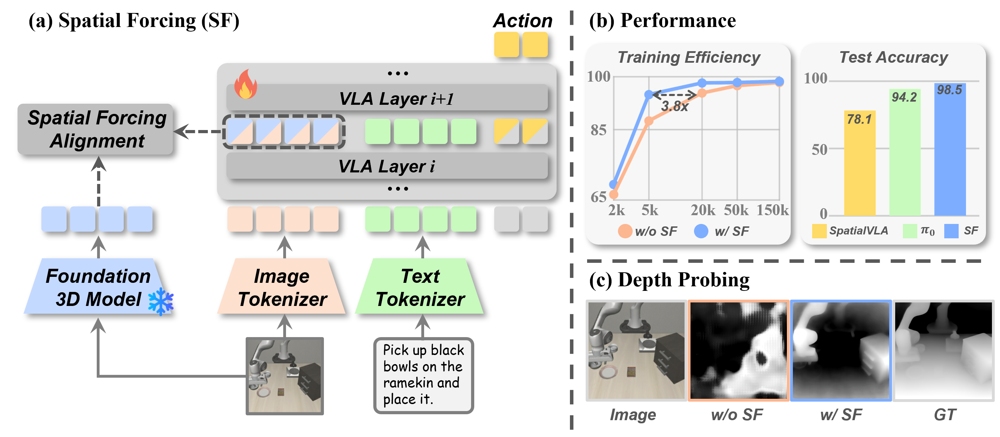

# Spatial Forcing: Implicit Spatial Representation Alignment for Vision-language-action Model
<div align="center">

[](http://arxiv.org/abs/2510.12276) [](https://spatial-forcing.github.io/) [](https://huggingface.co/collections/haofuly/spatial-forcing-68ea1bf0f1ac2c60e2ec6caa)

</div>
<!-- TODO 替换掉论文的链接 -->

## 🌟 Key Features of Spatial-Forcing (SF)

1. **Universality**: SF is a **plug-and-play** 3D finetune strategy that can be seamlessly integrated with any VLA training process, requiring only **30 lines** of code modifications. It substantially enhances spatial reasoning and manipulation capabilities. We provide implementations based on **OpenVLA** and **Pi0**, along with a **quick-start guide** for adapting SF to other VLA models.

2. **Strong Performance**: SF achieves **state-of-the-art (SOTA)** results on both **LIBERO** and **RoboTwin** benchmarks.  
In real-world experiments involving complex spatial structures, SF improves task success rates by **up to 50%**.

3. **Efficient Training**: SF requires only **3% of the training steps** or **5% of the training data** to reach a 66% success rate on LIBERO-Long. Moreover, it achieves strong real-world performance with as few as **20 demonstrations**.


## 📃 Overview


Our model aligns the intermediate visual embeddings of VLAs with geometric representations produced by pretrained 3D foundation models. This alignment demonstrates enhanced performance, training efficiency, and data effificency.


<!-- ## Table of Contents
- [🚀 Get Started](#-get-started)
  - [Environment Setup](#environment-setup)
  - [Data Preparation](#data-preparation)
  - [Inference](#inference)
  - [Training](#training) -->


## 🚀 Get Started
> - To reproduce our results, please follow our documentation step by step.<br/>
> - To integrate Spatial-Forcing into your VLA model, please ref to the [Training Scripts Line373-Line400](./vla-scripts/finetune_align.py#L373-L399).


### Environment Setup
```bash
# Create and activate conda environment
conda create -n spatialforcing python=3.10.16 -y
conda activate spatialforcing

# Install PyTorch
pip install torch==2.2.0 torchvision==0.17.0 torchaudio==2.2.0

# Clone spatial-forcing repo and pip install to download dependencies
git clone https://github.com/OpenHelix-Team/Spatial-Forcing.git
cd Spatial-Forcing
pip install -e .

# Install Flash Attention 2 for training (https://github.com/Dao-AILab/flash-attention)
#   =>> If you run into difficulty, try `pip cache remove flash_attn` first
pip install packaging ninja
ninja --version; echo $?  # Verify Ninja --> should return exit code "0"
pip install "flash-attn==2.5.5" --no-build-isolation
```
- If you are uncertain about the version of a dependency, please refer to our [**complete envs list**](envs_list.txt).


### Data Preparation
First, clone and install the [LIBERO repo](https://github.com/Lifelong-Robot-Learning/LIBERO) and required packages:
```bash
git clone https://github.com/Lifelong-Robot-Learning/LIBERO.git
pip install -e LIBERO
pip install -r experiments/robot/libero/libero_requirements.txt  # From spatial-forcing base dir
```

(Optional, if you plan to launch training) Then, to download the [LIBERO datasets](https://huggingface.co/datasets/openvla/modified_libero_rlds) that we used in our fine-tuning experiments, run the command below or download them manually. This will download the LIBERO-Spatial, LIBERO-Object, LIBERO-Goal, and LIBERO-10 datasets in RLDS data format (~10 GB total). You can use these to fine-tune Spatial-Forcing or train other methods like OpenVLA. Note that these are the same datasets used in the original OpenVLA project. If needed, see details on how to download the original non-RLDS datasets [here](https://github.com/openvla/openvla?tab=readme-ov-file#libero-setup).
```bash
git clone git@hf.co:datasets/openvla/modified_libero_rlds ./data/libero  # or download manually
```

Finally, the directory structure will be as below:
```
Spatial-Forcing
    ├── data
    ·   ├── libero
        │   ├── libero_10_no_noops
        │   │   └── 1.0.0  (It contains some json files and 32 tfrecord files)
        │   ├── libero_goal_no_noops
        │   │   └── 1.0.0  (It contains some json files and 16 tfrecord files)
        │   ├── libero_object_no_noops
        │   │   └── 1.0.0  (It contains some json files and 32 tfrecord files)
        │   ├── libero_spatial_no_noops
        │   │   └── 1.0.0  (It contains some json files and 16 tfrecord files)
        │
        └── other benchmarks ...
```


### Inference
We fine-tuned OpenVLA via LoRA (r=32) on four LIBERO task suites: LIBERO-Spatial, LIBERO-Object, LIBERO-Goal, and LIBERO-10 (also called LIBERO-Long).

Below are the four independently trained Spatial-Forcing checkpoints for LIBERO:
* [spatial-forcing-7b-finetuned-libero-spatial](https://huggingface.co/haofuly/spatial-forcing-7b-finetuned-libero-spatial)
* [spatial-forcing-7b-finetuned-libero-object](https://huggingface.co/haofuly/spatial-forcing-7b-finetuned-libero-object)
* [spatial-forcing-7b-finetuned-libero-goal](https://huggingface.co/haofuly/spatial-forcing-7b-finetuned-libero-goal)
* [spatial-forcing-7b-finetuned-libero-10](https://huggingface.co/haofuly/spatial-forcing-7b-finetuned-libero-10)

First, download these checkpoints and place them in the `./ckpts/` folder. The directory structure is as below:
```
Spatial-Forcing
    ├── ckpts
    ·   ├── spatial-forcing-7b-finetuned-libero-spatial
        ·   ├── lora_adapter (folder)
            ├── action_head--latest_checkpoint.pt
            ├── model-00001-of-00003.safetensors
            └── ...
```

Then, run the commands below to start evaluations with the independently trained checkpoints:
```bash
# Launch LIBERO-Spatial evals
python experiments/robot/libero/run_libero_eval.py \
  --pretrained_checkpoint ckpts/spatial-forcing-7b-finetuned-libero-spatial \
  --task_suite_name libero_spatial

# if you want to eval on LIBERO-Object/Goal/10,
# just modify the settings `--pretrained_checkpoint` and `--task_suite_name`
```

Notes:
* The evaluation script will run 500 trials by default (10 tasks x 50 episodes each). You can modify the number of
  trials per task by setting `--num_trials_per_task`. You can also change the random seed via `--seed`. There are
  other arguments in the script; we set them to the default values that work with the Spatial-Forcing checkpoints above.
* **NOTE: Setting `--center_crop True` is important** because we fine-tuned Spatial-Forcing with random crop augmentations
  (we took a random crop with 90% area in every training sample, so at test time we simply take the center 90% crop).
* The evaluation script logs results locally. You can also log results in Weights & Biases
  by setting `--use_wandb True` and specifying `--wandb_project <PROJECT>` and `--wandb_entity <ENTITY>`.
* The results reported in our paper were obtained using **Python 3.10.16, PyTorch 2.2.0, and
  [bidirectional transformers](https://github.com/moojink/transformers-openvla-oft.git)**
  on an **NVIDIA H100 GPU**. Please stick to these package versions if possible.


### Training
First, be sure you have downloaded the LIBERO datasets, as mentioned in the [Data Preparation Section](#data-preparation): `libero_spatial_no_noops`, `libero_object_no_noops`, `libero_goal_no_noops`, `libero_10_no_noops`. (`"_no_noops"` stands for no no-op actions, i.e., training samples with near-zero actions are filtered out).

Then, download the [OpenVLA](https://huggingface.co/openvla/openvla-7b/tree/main) and [VGGT](https://huggingface.co/facebook/VGGT-1B/blob/main/model.pt) foundation models and place them in the `./ckpts/` folder. The directory structure is as below:
```
Spatial-Forcing
    ├── ckpts
    ·   ├── openvla-7b
        │   ├── added_tokens.json
        │   ├── model-00001-of-00003.safetensors
        │   └── ...
        ├── model.pt (the VGGT checkpoints)
        ·
```

Next, launch the fine-tuning script below, replacing `X` in the first line with the number of GPUs. The command below launches fine-tuning on LIBERO-Spatial with the hyperparameters that we used in our paper. Here, batch size 8 per GPU will require ~74 GB VRAM, and batch size 1 per GPU will require ~30 GB VRAM. The training results are stored according to the `--run_root_dir` and `--run_id_override`.

```bash
torchrun --standalone --nnodes 1 --nproc-per-node X vla-scripts/finetune_align.py \
  --vla_path ckpts/openvla-7b \
  --vggt_path ckpts/model.pt \
  --data_root_dir data/libero/ \
  --dataset_name libero_spatial_no_noops \
  --run_root_dir ckpts/training_results/ \
  --pooling_func bilinear \
  --vla_layers_align 24 \
  --vggt_layers_align -1 \
  --align_loss_type cosine \
  --align_loss_coeff 0.5 \
  --use_l1_regression True \
  --use_diffusion False \
  --use_film False \
  --use_vlm_norm True \
  --use_vggt_pe True \
  --num_images_in_input 2 \
  --use_proprio True \
  --batch_size 8 \
  --learning_rate 5e-4 \
  --num_steps_before_decay 100000 \
  --max_steps 150005 \
  --save_freq 10000 \
  --save_latest_checkpoint_only True \
  --merge_lora_during_training True \
  --image_aug True \
  --lora_rank 32 \
  --wandb_entity "YOUR_WANDB_ENTITY" \
  --wandb_project "YOUR_WANDB_PROJECT" \
  --run_id_override "YOUR_RUN_ID"
```

The above training command should reproduce our Spatial-Forcing results if `X = 8` and the 150K step checkpoint is evaluated.

Please be sure to test your policy with the same device/GPU used to train it! Otherwise, performance may drop substantially. You may be able to avoid the performance drop if you merge the LoRA weights into the base model on the downstream device used for testing (e.g., if you train on H100 and then merge on A100 before testing on A100). You can see our script [vla-scripts/merge_lora_weights_and_save.py](vla-scripts/merge_lora_weights_and_save.py) for merging the LoRA adapter into the base model offline. It's okay if you already merged LoRA weights into the base OpenVLA model during fine-tuning; you can always redownload the base model and merge again as long as you still have the LoRA adapter (`merge_lora_weights_and_save.py` will handle this for you).


## 🔥 TODO List
- [x] Training and inference code on LIBERO (Base model: OpenVLA)
- [x] Checkpoints on LIBERO (Base model: OpenVLA)
- [ ] Deployment code in the real world
- [ ] Code and checkpoints on RoboTwin (Base model: Pi_0)


## 🌏 Contact
For further discussion and collaboration, please feel free to contact us via Email and WeChat:

| Author | Email | WeChat |
|:---:|:---:|:---:|
| Fuhao Li | lfh23@mails.tsinghua.edu.cn | haofuly |
| Wenxuan Song | songwenxuan0115@gmail.com | swx0757 |


## ❤️ Acknowledgement
We thank these great works and open-source codebases: [OpenVLA-OFT](https://github.com/moojink/openvla-oft) & [VGGT](https://github.com/facebookresearch/vggt) & [REPA](https://github.com/sihyun-yu/REPA)


## 🖊 Citation
If you find this work useful, please cite:

```bibtex
@article{spatialforcing2025,
  author    = {Fuhao Li, Wenxuan Song, Han zhao, Jingbo Wang, Pengxiang Ding, Donglin Wang, Long Zeng, Haoang Li},
  title     = {Spatial Forcing: implicit Spatial Representation Alignment For Vision-Language-Action Model},
  journal   = {},
  year      = {2025},
}
```
